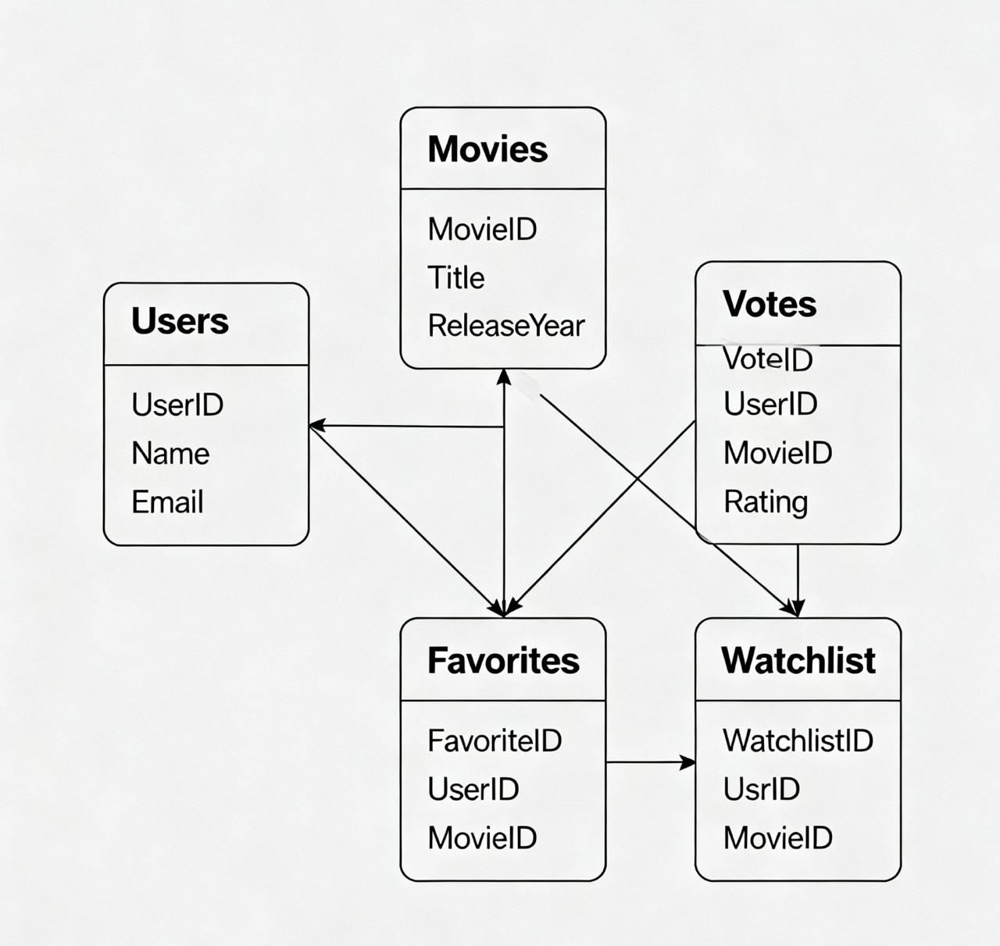

# 🎬 KMA FILMS

Discover, track, and love your movies.

---

## ✨ Main Features
- 👤 Fast user registration and authentication
- 📃 Browse movies (sorted by newest first)
- 🔍 Search for movies by title
- 📝 View movie details: title, description, director, release year, rating, country, genre, and poster image
- 👍👎 Like or dislike movies (one vote per user per movie)
- ⭐ Aggregated world rating scores (from external sources)
- ❤️ Add movies to personal favorites
- 🎯 Maintain a watchlist (“Plan to watch”)
- 🙍‍♂️ User profile (username, favorites, watchlist, bio)
- ℹ️ About page with project information and contact details

---

## ⚡️ REST API Endpoints

**Authentication**
- `POST /api/auth/register` — Register new user
- `POST /api/auth/login` — Login
- `POST /api/auth/logout` — Logout

**Movies**
- `GET /api/movies/` — Retrieve all movies (sorted by year, searchable by title)
- `GET /api/movies/{id}/` — Retrieve movie details
- `POST /api/movies/` — Add a new movie *(authenticated users only)*
- `PUT /api/movies/{id}/` — Edit own movie *(only creator)*
- `DELETE /api/movies/{id}/` — Delete own movie *(only creator)*

**Votes**
- `POST /api/movies/{id}/like/` — Like a movie *(authenticated users only)*
- `POST /api/movies/{id}/dislike/` — Dislike a movie *(authenticated users only)*
- `GET /api/movies/{id}/votes/` — Get number of likes and dislikes

**Favorites**
- `GET /api/users/favorites/` — View personal favorites *(authenticated users only)*
- `POST /api/users/favorites/` — Add a movie to favorites *(authenticated users only, JSON: movie_id)*
- `DELETE /api/users/favorites/{movie_id}/` — Remove from favorites *(authenticated users only)*

**Watchlist**
- `GET /api/users/watchlist/` — View watchlist *(authenticated users only)*
- `POST /api/users/watchlist/` — Add a movie to watchlist *(authenticated users only, JSON: movie_id)*
- `DELETE /api/users/watchlist/{movie_id}/` — Remove from watchlist *(authenticated users only)*

**User Profile**
- `GET /api/users/profile/` — Retrieve user profile *(authenticated users only)*
- `PUT /api/users/profile/` — Edit user bio *(authenticated users only)*

**Information**
- `GET /api/about/` — Project information and contacts

---

## 🗄️ Database Structure

The main entities are:
- **Users** — stores user profiles and authentication data
- **Movies** — movie information and metadata
- **Votes** — links users to movies with a like (+1) or dislike (-1)
- **Favorites** — tracks each user's favorite movies
- **Watchlist** — tracks movies a user plans to watch

---